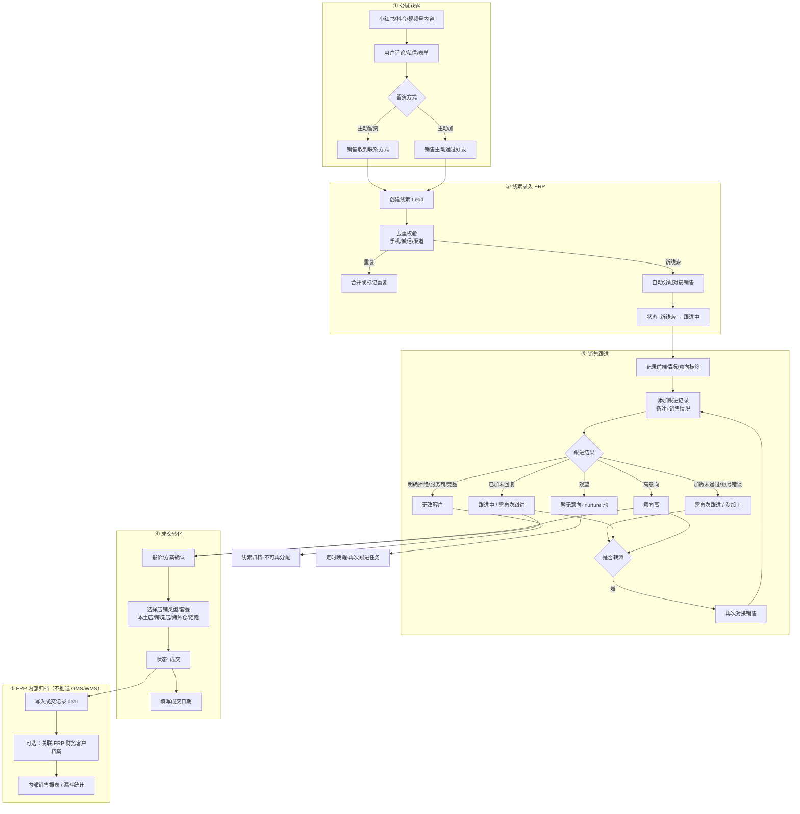
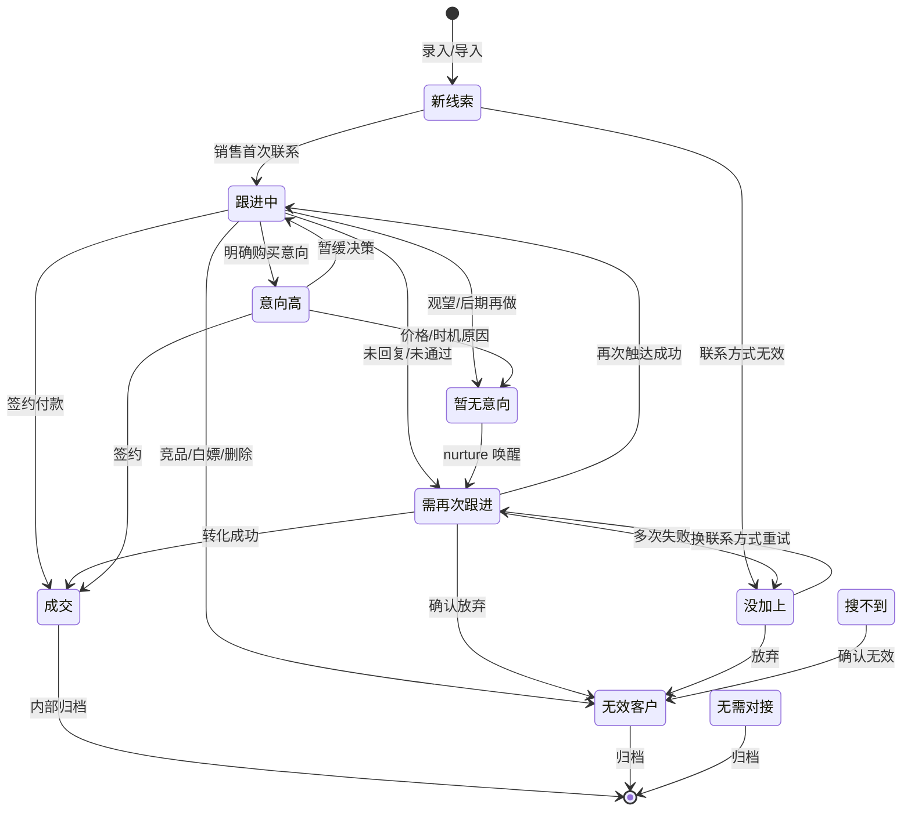
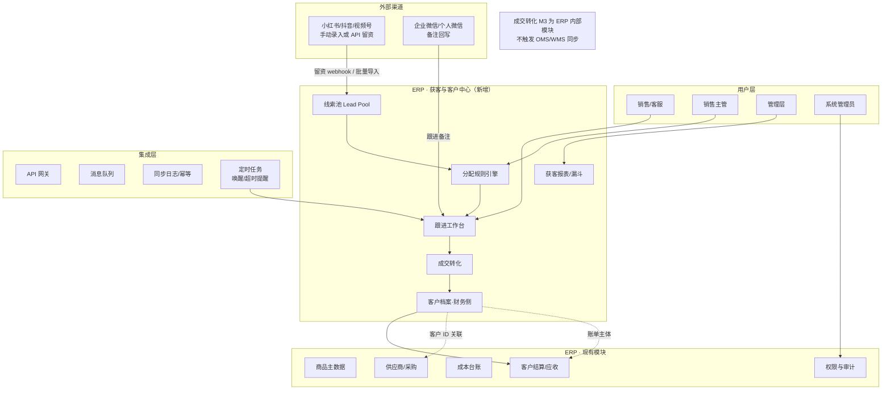
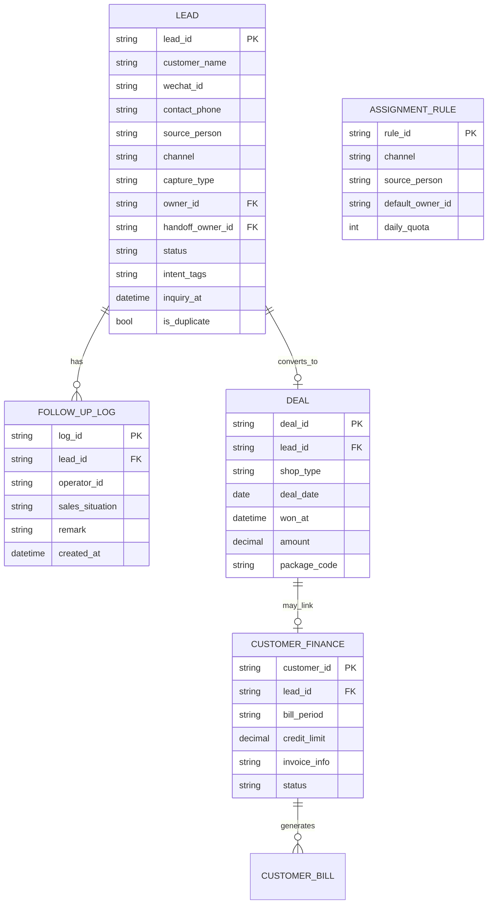
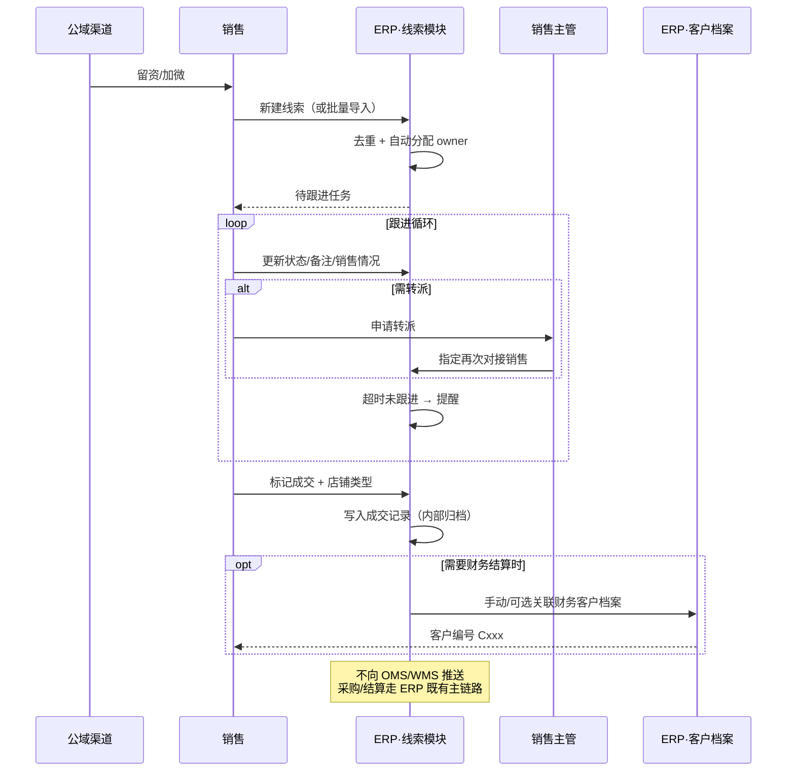

# 网上获客 · 客户管理模块 — 流程图与架构设计

> 依据 `客户管理.xlsx`（订单跟进明细，约 3080 条线索）梳理，并对接现有 Takealot ERP PRD 边界。

---

## 1. Excel 现状摘要

| 维度 | 内容 |
|------|------|
| 数据量 | 约 3080 行线索，152 条成交 |
| 主渠道 | 抖音 1554 / 小红书 951 / 视频号 311 / 其他 259 |
| 留资方式 | 主动留资 2861 / 主动加 194 |
| 跟进状态 | 需再次跟进 1091 / 跟进中 905 / 无效 302 / 成交 152 / 没加上 134 / 暂无意向 93 / 意向高 45 |
| 店铺类型（成交） | 跨境店、本土店、海外仓、直邮、陪跑等组合套餐 |

**Excel 字段 → 系统字段映射：**

| Excel 列 | 系统实体 | 说明 |
|----------|----------|------|
| 客户名称 / 客户微信 / 联系方式 | `lead` 线索主档 | 去重键：手机号 / 微信号 |
| 客户获客来源 | `lead_source` | 投放人/引荐人（陈、彩云、转介绍等） |
| 渠道 | `channel` | 小红书 / 抖音 / 视频号 / 其他 |
| 留资方式 | `capture_type` | 主动留资 / 主动加 |
| 对接销售 | `owner_id` | 首次负责销售 |
| 再次对接销售 | `handoff_owner_id` | 二次跟进负责人 |
| 咨询时间 | `inquiry_at` | 首次咨询时间 |
| 前端情况 | `intent_tag` | 客户诉求标签（了解跨境、入驻、海外仓…） |
| 跟进状态 | `lead_status` | 状态机核心 |
| 销售备注 / 销售情况 | `follow_up_log` | 跟进记录（时间线） |
| 成交日期 / 成交时间 / 店铺类型 | `deal` | 成交单与套餐类型 |

---

## 2. 端到端业务流程图



---

## 3. 线索状态机



**与 Excel 状态对齐：**

| Excel 跟进状态 | 系统状态码 | 是否可编辑 | 是否计入漏斗 |
|----------------|------------|------------|--------------|
| 跟进中 | `following` | 是 | 是 |
| 需再次跟进 | `recall` | 是 | 是 |
| 意向高 | `hot` | 是 | 是 |
| 成交 | `won` | 锁定 | 是（转化） |
| 无效客户 | `invalid` | 锁定 | 否 |
| 暂无意向，等后期开发 | `nurture` | 是 | 是（培育池） |
| 没加上 | `no_contact` | 是 | 是 |
| 无需对接 | `no_need` | 锁定 | 否 |
| 搜不到 | `not_found` | 是 | 否 |

---

## 4. 系统总体架构



---

## 5. 模块边界（与现有 PRD 的关系）

| 对象 | 获客模块（新增） | ERP 现有职责 | OMS 职责 |
|------|------------------|--------------|----------|
| 线索 Lead | **主责**：录入、分配、跟进、状态 | 不管理 | 不管理 |
| 销售跟进记录 | **主责** | 审计日志引用 | — |
| 成交/套餐 | **主责**：内部记录成交事实与套餐类型 | 不直接管理 | 不推送、不管理 |
| 财务客户档案 | 可选内部关联 | **主责**：账期、信用、开票 | 展示门户（独立流程） |
| 订单/发货/结算 | — | **主责** | 客户下单 |

> **边界说明**：获客与成交转化是 **ERP 内部销售运营模块**，成交后不向 OMS/WMS 推送。OMS/WMS 的客户开通、店铺绑走各自独立流程，与成交模块解耦。

---

## 6. 核心数据模型



---

## 7. 销售跟进时序（单条线索）



---

## 8. ERP 侧边栏菜单建议

```
概览
  └─ 工作台（新增：今日待跟进、成交漏斗 KPI）

获客与销售          ← 新增一级模块
  ├─ 线索池          （列表/筛选/批量导入）
  ├─ 我的跟进        （销售个人工作台）
  ├─ 成交管理        （已成交客户、店铺类型）
  └─ 获客报表        （渠道转化、销售排行、漏斗）

产品开发 / 采购 / 财务 …（现有模块不变）
  └─ 客户结算        （关联 customer_id，从成交转入）
```

---

## 9. 关键接口清单（新增）

| 编号 | 方向 | 说明 | 触发时机 |
|------|------|------|----------|
| INT-CRM-001 | 渠道 → ERP | 留资 webhook / Excel 导入 | 新线索产生 |
| INT-CRM-002 | ERP 内部 | 线索 → 成交记录归档 | 线索状态 = 成交 |
| INT-CRM-003 | ERP 内部 | 成交 → 财务客户档案（可选关联） | 人工确认需结算时 |
| INT-CRM-004 | ERP → 企微 | 跟进提醒/待办推送（可选） | 需再次跟进超时 |

> **不含** ERP → OMS / ERP → WMS 接口。成交转化不触发下游系统同步。

---

## 10. 报表指标（对应管理需求）

| 指标 | 计算口径 |
|------|----------|
| 渠道获客量 | 按 channel 分组 count(lead) |
| 加微通过率 | 已加微信 / (已加 + 加微未通过 + 账号错误) |
| 漏斗转化率 | 成交 / 有效线索（排除无效、搜不到） |
| 销售人效 | 按 owner / handoff_owner 统计跟进量、成交量 |
| 平均成交周期 | won_at - inquiry_at |
| 套餐分布 | 按 shop_type 统计成交结构 |
| 培育池唤醒率 | nurture → recall/won 比例 |

当前 Excel 粗算：**总线索 ~2750 有效状态记录，成交 152，转化率约 5.5%**（与渠道/销售维度下钻后可做基准线）。

---

## 11. 分期实施建议

| 阶段 | 范围 | 说明 |
|------|------|------|
| **P1-A** | 线索 CRUD + 状态机 + 跟进记录 + Excel 导入 | 替代现有表格，3080 条历史数据迁移 |
| **P1-B** | 分配规则 + 待跟进提醒 + 基础漏斗报表 | 提升销售效率 |
| **P1-C** | 成交内部归档 + 可选关联财务客户 | 与 PRD P1 客户结算弱耦合，不自动推送 |
| **P2** | 企微集成、渠道 API 留资、nurture 自动唤醒 | 减少手工录入 |

---

## 12. 权限设计

| 角色 | 线索池 | 他人线索 | 成交确认 | 获客报表 | 分配规则 |
|------|--------|----------|----------|----------|----------|
| 销售 | 读写自己的 | 只读 | 自己的 | 个人 | — |
| 销售主管 | 全部 | 读写 | 全部 | 团队 | 配置 |
| 管理层 | 只读 | 只读 | 只读 | 全部 | 只读 |
| 财务 | — | — | 只读 | 成交汇总 | — |
| 系统管理员 | 全部 | 全部 | 全部 | 全部 | 全部 |

---

*文档版本：V0.2 · 2026-06-12 · 成交转化为 ERP 内部模块，不推送 OMS/WMS*
